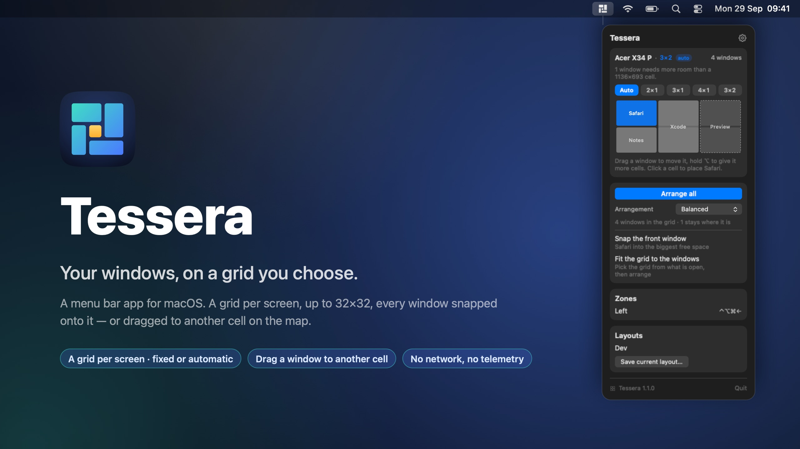
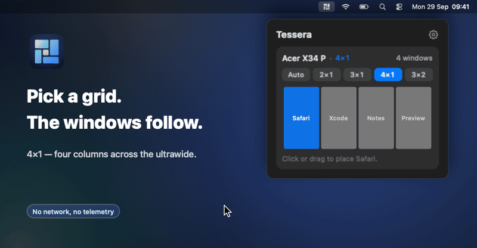
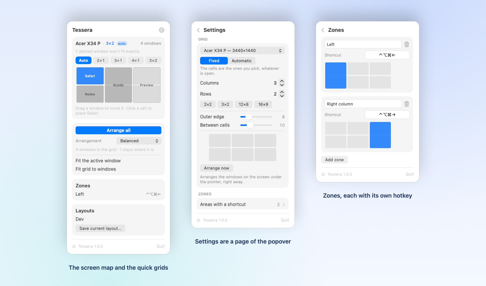

<p align="center">
  
</p>

<p align="center">
  <a href="https://github.com/giacolaiacomo/tessera/actions/workflows/build.yml"></a>
  
  
  
  
  
</p>

# Tessera

**Your windows, on a grid you choose.** Tessera sits in the menu bar and tiles the windows on each
screen onto a grid — 3×2, 4×2, or anything up to 32×32 — instead of the usual four quadrants.

<p align="center">
  
</p>

<p align="center">
  
</p>

## Features

- **It knows how small your apps go.** Every time a window refuses the cell it was given,
  Tessera remembers the size it kept — that is the app's minimum, learned for free. The
  automatic grid then never proposes cells your apps would refuse: on a 1512-wide laptop screen
  with apps that will not go below ~750, that means two columns, not three, and the windows that
  cannot fit are left where they are instead of being piled up. A grid you set by hand is still
  obeyed to the letter, and the popover tells you how many windows need more room than its cells.
- **A grid per screen, fixed or automatic.** Fixed is the grid you pick: 2×1, 3×1, 4×1, 3×2 and
  4×2 are one click away as presets in the popover, and the steppers go up to 32×32. Automatic
  derives the grid from how many windows are open on that screen, so they all fit and all stay
  visible — four windows on an ultrawide become 2×2, six become 3×2. Outer and inner gaps are
  yours to set, per screen; the mode only decides how many cells there are.
- **A live map of the screen,** in the popover. It shows the windows that are on that screen right
  now, drawn on the cells they occupy and labelled with their app. Drag a window's tile to move
  that window; click a cell — or drag across several — to send the frontmost window there.
- **Arrange all,** with five arrangements: **Balanced** (as square as the screen allows),
  **One per cell** (the grid taken literally, empty cells stay empty), **Columns**, **Rows**, and
  **Master + stack** (the front window large on the left, the rest stacked on the right). Windows
  past the grid's capacity are left exactly where they are.
- **Zones.** A named span of cells with a global hotkey: press it and the active window goes there.
- **Saved layouts.** Capture where everything is right now, restore it later, with an optional
  hotkey of its own.
- **Auto-fit new windows** (optional): a window that has just opened lands in the largest free area
  of the grid.
- **Careful with your desktop.** **Arrange all** only ever touches the screen under the pointer,
  never your other displays. Only the Desktop/Space you are on is touched, full-screen windows are
  skipped, and each window is placed with a single write — no visible shuffling while it lands.
- **The shortest way round.** Which window goes into which cell is chosen to move the windows as
  little as possible, so a window already sitting on its cell stays put instead of swapping with
  a neighbour.
- **Everything in one popover.** Settings are a page of it, not a separate window. English and
  Italian (System / English / Italiano).
- **Nothing leaves your Mac.** No network requests at all, no telemetry, no account. Configuration
  is one readable file at `~/Library/Application Support/Tessera/config.json` — including the app
  minimums it has learned, which are bundle ids and sizes, nothing else.
- **Small.** Swift with AppKit and SwiftUI, no dependencies, no Xcode project, about 29 MB of RAM.

## Install

You need macOS 13+ and the Swift toolchain (`xcode-select --install`). Either way, Tessera is built
from source on your Mac.

**Homebrew**

```sh
brew install giacolaiacomo/tap/tessera
brew services start tessera     # start now and at every login
```

To update: `brew upgrade tessera`. To remove it: `brew services stop tessera && brew uninstall tessera`.

**From source**

```sh
git clone https://github.com/giacolaiacomo/tessera.git
cd tessera
./install.sh
```

This builds `~/Applications/Tessera.app` and opens it. To update: `git pull && ./install.sh`.
To remove it: `./uninstall.sh`.

## Accessibility access

macOS will not let one app touch another app's windows unless you say so, and that permission *is*
the feature: without it Tessera cannot move anything. The first launch asks for it and takes you to
**System Settings › Privacy & Security › Accessibility**. Tick the box and it works immediately —
no restart.

Tessera reads the window list of the current Desktop (app, title, frame) and writes positions and
sizes. It never reads what is inside a window. See [SECURITY.md](SECURITY.md).

One practical note: macOS ties the grant to the app's **signature**, not its path.
`scripts/build-app.sh` signs with your Apple Development identity when you have one, so the
permission survives a rebuild. With only an ad-hoc signature, every rebuild looks like a different
app and macOS asks again.

## Usage

**The popover.** Click the menu bar icon. The top of it is the map of the current screen; below it
are the quick grid presets, **Arrange all**, and the pages for zones, layouts and settings.

- **Move one window:** drag its tile on the map to another cell. That window moves, not the front
  one, and the popover stays open so you can move the next one. Hold **⌥** while dragging to give
  it a rectangle of cells instead of keeping its size — that is how a window becomes a tall column.
  A dashed tile (an app that cannot take the size of its cell) drags like any other. Dropping a
  window where another one already sits **swaps** them — you see which window is about to move out,
  faded in the cell you are emptying, before you let go. The one that was there takes the cell you
  just left.
- **Place the front window:** click a cell, or drag across a rectangle of cells starting from an
  empty one.
- **Pick a grid:** tap a preset (2×1, 3×1, 4×1, 3×2, 4×2) or set columns and rows with the
  steppers, up to 32×32 — per screen, and per screen you can switch that grid between Fixed and
  Automatic. With **Rearrange on grid change** on, the screen re-tiles the moment you change it.
- **Arrange all:** pick an arrangement — Balanced, One per cell, Columns, Rows, Master + stack —
  from the picker right under the button, and the frontmost windows fill the grid. Picking one
  makes it the default.
- **Zones:** name an area of the grid, give it a hotkey (⌃⌥1 and the like), and the active window
  snaps into it from anywhere.
- **Layouts:** save the current arrangement under a name, restore it with a click or a hotkey.

**From the command line.** The installed app is also the CLI, and these commands talk to the
running, authorised instance:

```sh
T=~/Applications/Tessera.app/Contents/MacOS/Tessera
$T --diagnose                       # what it sees and what it would do — moves nothing
$T --arrange balanced               # arrange the screen under the pointer
$T --arrange cells --screen Acer     # a chosen arrangement, on a chosen screen
$T --fit-grid --screen Acer          # pick the grid from the open windows, then tile them all
$T --place 2,0,1,2                   # the front window into a rectangle of cells: col,row,w,h
$T --exit-fullscreen                 # bring full-screen windows back to the Desktop
$T --icon icon.png 512               # draw the app icon (the only command that needs no permission)
```

`--diagnose` is the first thing to run when an arrangement is not what you expected. It moves
nothing:

```
Tessera 1.0.0 — diagnostics (no window is moved)
Accessibility access: on
Default arrangement: Balanced

Screen Built-in Retina Display [display-1]
  visibleFrame: 0,57 1512×892
  grid: 3×2, outer gap 8, inner gap 8 (fixed)
  windows on this Desktop: 2 — would arrange 2, would leave 0
    WhatsApp — 0,57 1512×892 → cell col 0 row 0 2×2 = 8,65 995×876
    Calendar — 8,438 995×503 → cell col 2 row 0 1×2 = 1011,65 493×876

Screen Acer X34 P [display-2]
  visibleFrame: -928,982 3440×1410
  grid: 3×2, outer gap 8, inner gap 8 (automatic: recomputed when you arrange, not now)
  windows on this Desktop: 5 — would arrange 5, would leave 0
    Terminal — -920,1690 1136×694 → cell col 0 row 0 1×1 = -920,1691 1136×693
    Terminal — -920,983 1137×700 → cell col 0 row 1 1×1 = -920,990 1136×693
    Terminal — 224,1690 1136×694 → cell col 1 row 0 1×1 = 224,1691 1136×693
    Terminal — 224,989 1136×694 → cell col 1 row 1 1×1 = 224,990 1136×693
    Terminal — 1368,985 1136×1399 → cell col 2 row 0 1×2 = 1368,990 1136×1394
```

`--arrange` and `--fit-grid` report the outcome window by window, including the reason a window
refused to move.

## What it can't do

Some windows do not obey, and that is not a bug in Tessera:

- **Apps with a minimum size** larger than their cell keep their size. Tessera reports it rather
  than pretending the window landed where it was asked to, and slides such a window back inside
  the screen instead of leaving it hanging off the edge.
- **Terminal** snaps to whole character rows and columns, so it lands a few pixels off its cell.
- **Full-screen windows** live on a Desktop of their own and are skipped. Use `--exit-fullscreen`
  or the green button to bring them back.
- **Only the current Desktop/Space** is arranged. Windows on other Spaces are not touched.

## Uninstall

```sh
./uninstall.sh                 # installed from source
```

or, with Homebrew:

```sh
brew services stop tessera && brew uninstall tessera
```

Either way your settings stay in `~/Library/Application Support/Tessera` — delete that folder if
you want them gone too.

## Development

```sh
./scripts/test.sh              # numeric checks on the grid maths (no UI, no permission needed)
./scripts/build-app.sh         # build/Tessera.app — takes an output path as its argument
./scripts/render-ui.sh         # render the popover and settings to PNG without launching the app
```

No Swift Package Manager and no Xcode project on purpose: the app is ten Swift files against
Apple's own frameworks, and `swiftc Sources/*.swift` is the whole build. `scripts/build-app.sh` is
the one place the bundle is assembled, and it is what `install.sh`, the Homebrew formula and CI all
call.

## License

[MIT](LICENSE)
